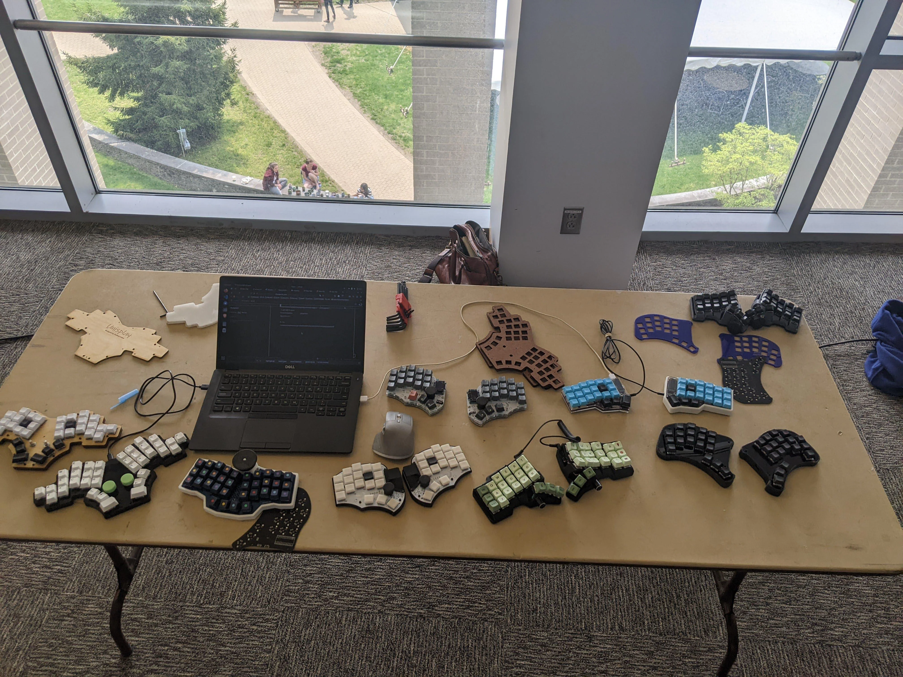

# Rigel96: a mid-ergonomic, split, columnar keyboard

In this discussion, I would like to:

1. Explain why I feel there is a gap in the market for a keyboard meeting a set of design requirements that haven't currently been explored fully by the community.
2. Show how those design requirements would influence the design of the keyboard.
3. Set out steps to build a prototype.

## §1. Why another keyboard?

As I understand it, there are two sub-communities within the keyboard hobby: the **ergonomicists** and the
**aesthetes**.

The **ergonomicists** are those who:
- Reject the concept of the ridiculous, historical row-staggered layouts (of ¼, ½, and ¼ U). Why on _earth_ type on a
  keyboard that isn't even designed for the human hand?
- Are willing to reject (or ignore) build quality concerns if those impact on the keyboard's ergonomics (for example,
  preferring a 3D-printed split keyboard to an CNC alumimium traditional case).

A typical collection of ergonomic keyboards from an ergonomicist (Credit: /u/teadetime, [via r/ErgoMechKeyboards](https://www.reddit.com/r/ErgoMechKeyboards/comments/145f952/my_growing_40_collection/))

The **aesthetes** are those who:
- Follow the latest switches, keycaps, and keyboard developments.
- Keyboards are rated based on their tactility, plate flex & feel, "thocc" (whatever that is to the speaker...), build
  quality, graphic design.
- Most of the community's energy goes towards building, lubricating, CNC milling aluminium, gaskets, and so on.

A typical collection of expensive traditional keyboards from an aesthete (Credit: /u/deej_is_typing, [via r/MechanicalKeyboards](https://www.reddit.com/r/MechanicalKeyboards/comments/11wqrlc/made_a_bookshelf_for_my_keyboard_collection/))

These two ideals are clearly pursuing different goals, and _both_ have made significant progress in the last decade.

Ten years ago in 2010, the custom keyboard hobby was just expanding. There were few choices then for keyswitches, or
keycaps. GMK's first group-buy for keycaps only ran in 2013 (I believe).

The _aesthetes_ made huge advances, through testing and iterating on keyboards, launching group-buys to push the hobby
forwards where manufacturers were afraid to commit investment on new product lines.

Features initially pioneered on enthusiast boards are now entering common availability on low-cost pre-built keyboards:
a gasket-mounted flexible (PC) plate; hotswap sockets; high-quality, low-cost factory-lubricated switches (such as
Gateron Milky Yellow Pro); acoustic foam; aluminium cases... Unbelievable ten years ago, when the state of the art for a
pre-built was a creaky ABS case with soldered-on Cherry MX Browns.

The _ergonomicists_ also forged ahead, taking inspiration from classics like the Kinesis Advantage (2002) or Maltron
(1970s). With cheap 3D printers available everywhere, custom designs profilerated. Two leading families are the Corne
and Ergodox, with most ergonomic keyboards now claiming inspiration from these, or one of their descendents.

> These two keyboard communities are pursuing two separate axes of aesthetics and ergonomics. Why are there so few
> design cross-overs between these communities? Is it really not possible to learn from both?

For me, this feels like a **gap of opportunity** in the market.

> Why not design a "nice", aesthetic design, that _retains_ the features most-loved by aesthetes (gasket-mount, flexibly typing feel, pleasant sound profile), while
> _incorporating_ the innovations explored by the ergonomicists?

I will formalise this as an attempt to pursue the following **design priorities**. (All designs are conceived and
developed according to a set of prioritised goals, which determine which qualities should win over others: price, build,
features... All designs involve trade-offs, explicitly or implicitly, which are resolved according to the design's
goals.)

> 1. The design must keep the **standard finger-to-key assignments** of a traditional keyboard.
> 2. The design must appeal to aesthetics enthusiasts: we cannot compromise on features that are regarded as **bare-minimum requirements for a 75% keyboard**.
> 3. The design must **not make any terrible ergonomic trade-offs**.

Regarding **finger-to-key assignments**, we believe that there is a large market of people who have learned to touch-type, and are scared to try to re-learn typing. This is evidenced by the vast community buying enthusiast-level TKL keyboards, 75% keyboards, even 40% keyboards – and all using the legacy row-staggered layout. Some of the most popular of these enthusiast boards are Keychron Q-series ($XXX), Mode Sonnet ($XXX), XXX ($XXX). So clearly there's a huge number of users who are simply very, very attached to their existing layout. Those users who are willing to move to a 40% board, yet not try split or columnar layouts, are surely an extreme example of commitment to aesthetics over ergonomics.

So, I regard it as a design principle that we should explore the design space of keyboards with four (or three) keys per finger (1-Q-A-Z, 2-W-S-X), laid out roughly in a column, and with a fairly standard location for the Shift keys, modifiers, Space bar, and so on.

Regarding the **aesthetic requirements**, I have ranked these higher than the ergonomic concerns. This is because, all else being equal, if we pursue ergonomics first then we'll simply be producing a Corne clone, which is not novel, and so far hasn't conquered the custom keyboards world. We have to see how far we can go on ergonomics, _without_ compromising on the minimum bar for aesthetics that dominates the mechanical community.

The **ergonomic trade-offs** are middle-of-the-road. Refusing to do anything terrible does rule out a lot of possibilities (given that most keyboards are in fact pretty terrible for ergonomics), but it doesn't compel us to pursue a mamixum-ergonomic route.

In conclusion, I feel that these reasonable requirements are hardly met by any current keyboards on the market, or in past Group Buys, which justifies blessing the world with yet another keyboard design!

## §2. Applying the three design principles

### Firstly, applying the principles to existing keyboards

XXX

### Secondly, producing a design that meets the three design principles

XXX

## §3. Steps towards a prototype

Broadly, I aim to:

1. Produce myself a set of CAD files for the keyboard plate. Status: ~done, first draft.
2. Post on GeekHack / other forums to get design feedback.
3. Finalise concrete manufacturing plans for a limited run of concept-prototypes (~10 units, perhaps). These would consist of a bare keyboard plate, screwed to a block of wood at the front and another at the back. Offer these prototypes on a forum for review & feedback.
4. Make design changes, propose a case design and manufacturing plan for a full unit (top+bottom case, plate, and PCB or hand-wiring plan).
5. Run an Interest Check to poll for final feedback.
6. Run a Group Buy to produce perhaps ~50 units (or more, but I'd be astonished if even 50 bought my keyboard).

The first steps, doing some CAD and soliciting feedback, are simple, and I can certainly do them myself.

From then on, it all depends on the level of interest received.

* If it falls flat, then I guess I'll make a single unit with hand tools at home. I certainly wouldn't ever be able to get a CNC case (or even 3D resin-printed case).
* If it picks up interest, and ten people would be willing to participate in a round of prototying, that would be exciting.

XXX document what I have already: the CAD files