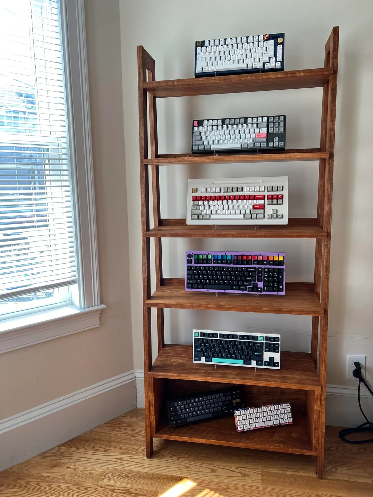

# Rigel96: a mid-ergonomic, split, columnar keyboard

In this discussion, I would like to:

1. Explain why I feel there is a gap in the market for a keyboard meeting a set of design requirements that haven't currently been explored fully by the community.
2. Show how those design requirements would influence the design of the keyboard.
3. Set out steps to build a prototype.

## 1. Why another keyboard?

As I understand it, there are two sub-communities within the keyboard hobby: the **ergonomicists** and the
**aesthetes**.

The **ergonomicists** are those who:
- Reject the concept of the ridiculous, historical row-staggered layouts (of ¼, ½, and ¼ U). Why on _earth_ type on a
  keyboard that isn't even designed for the human hand?
- Are willing to reject (or ignore) build quality concerns if those impact on the keyboard's ergonomics (for example,
  preferring a 3D-printed split keyboard to an CNC alumimium traditional case).

A typical collection of ergonomic keyboards from an ergonomicist (Credit: /u/teadetime, [via r/ErgoMechKeyboards](https://www.reddit.com/r/ErgoMechKeyboards/comments/145f952/my_growing_40_collection/))

The **aesthetes** are those who:
- Follow the latest switches, keycaps, and keyboard developments.
- Keyboards are rated based on their tactility, plate flex & feel, "thocc" (whatever that is to the speaker...), build
  quality, graphic design.
- Most of the community's energy goes towards building, lubricating, CNC milling aluminium, gaskets, and so on.

A typical collection of expensive traditional keyboards from an aesthete (Credit: /u/deej_is_typing, [via r/MechanicalKeyboards](https://www.reddit.com/r/MechanicalKeyboards/comments/11wqrlc/made_a_bookshelf_for_my_keyboard_collection/))

These two ideals are clearly pursuing different goals, and _both_ have made significant progress in the last decade.

Ten years ago in 2010, the custom keyboard hobby was just expanding. There were few choices then for keyswitches, or
keycaps. GMK's first group-buy for keycaps only ran in 2013 (I believe).

The _aesthetes_ made huge advances, through testing and iterating on keyboards, launching group-buys to push the hobby
forwards where manufacturers were afraid to commit investment on new product lines.

Features initially pioneered on enthusiast boards are now entering common availability on low-cost pre-built keyboards:
a gasket-mounted flexible (PC) plate; hotswap sockets; high-quality, low-cost factory-lubricated switches (such as
Gateron Milky Yellow Pro); acoustic foam; aluminium cases... Unbelievable ten years ago, when the state of the art for a
pre-built was a creaky ABS case with soldered-on Cherry MX Browns.

The _ergonomicists_ also forged ahead, taking inspiration from classics like the Kinesis Advantage (2002) or Maltron
(1970s). With cheap 3D printers available everywhere, custom designs profilerated. Two leading families are the Corne
and Ergodox, with most ergonomic keyboards now claiming inspiration from these, or one of their descendents.

> These two keyboard communities are pursuing two separate axes of aesthetics and ergonomics. Why are there so few
> design cross-overs between these communities? Is it really not possible to learn from both?

For me, this feels like a **gap of opportunity** in the market.

> Why not design a "nice", aesthetic design, that _retains_ the features most-loved by aesthetes (gasket-mount, flexibly typing feel, pleasant sound profile), while
> _incorporating_ the innovations explored by the ergonomicists?

I will formalise this as an attempt to pursue the following **design priorities**. (All designs are conceived and
developed according to a set of prioritised goals, which determine which qualities should win over others: price, build,
features... All designs involve trade-offs, explicitly or implicitly, which are resolved according to the design's
goals.)

1. The design must keep the **standard finger-to-key assignments** of a traditional keyboard.
2. XXX