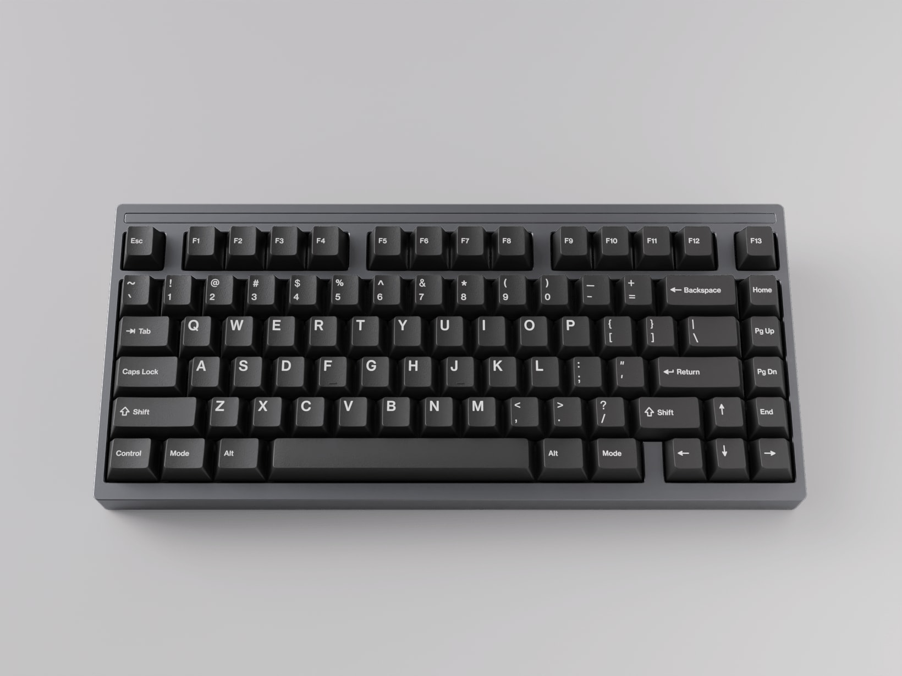
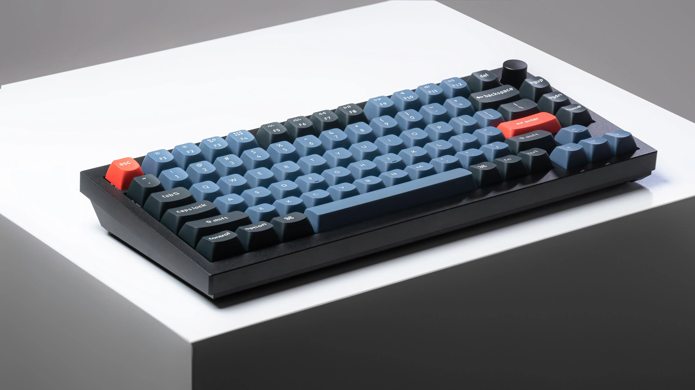
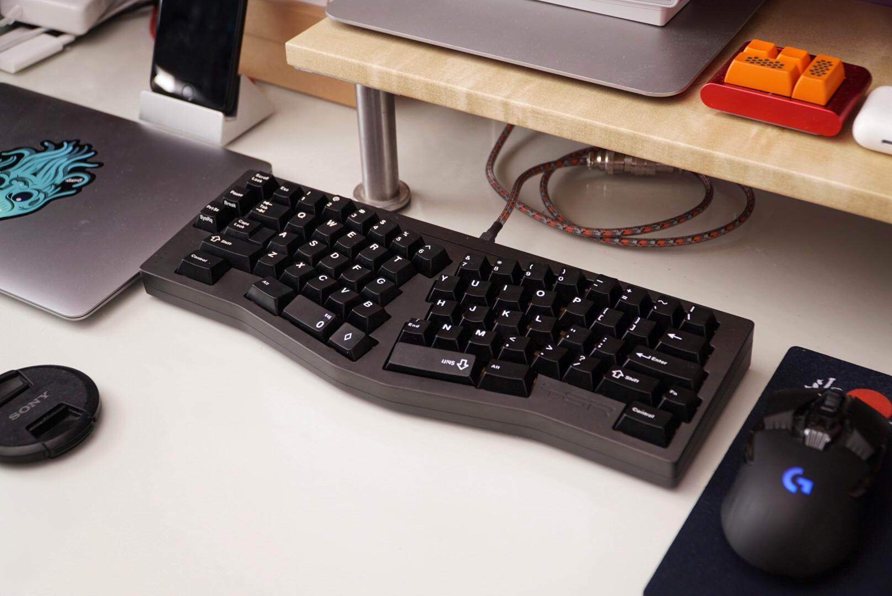
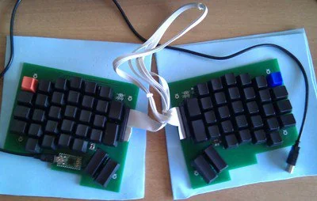
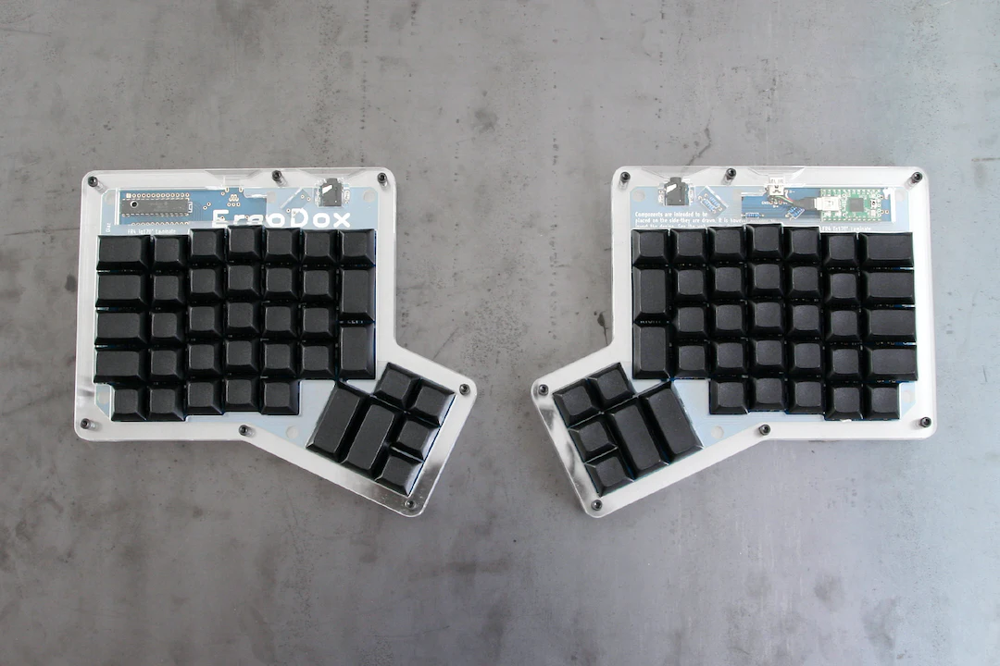
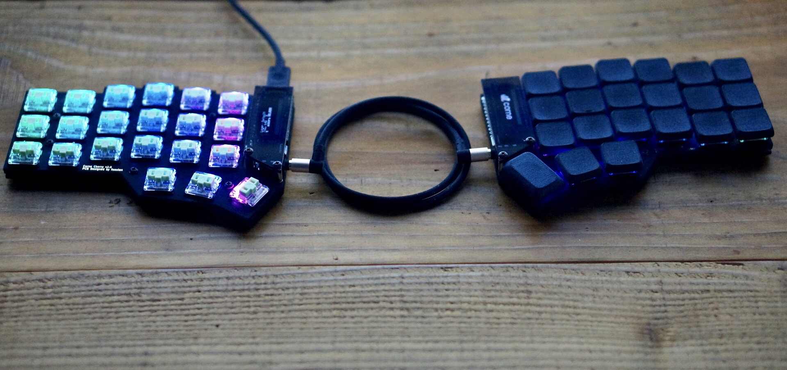
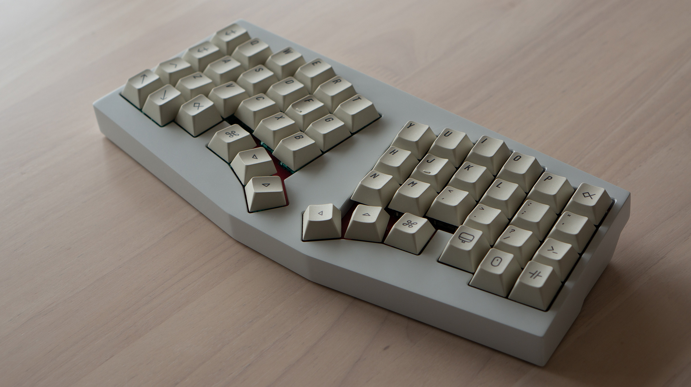
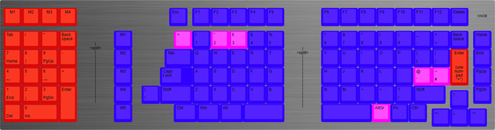

# Rigel96: a mid-ergonomic, split, columnar keyboard

In this discussion, I would like to:

1. Explain why I feel there is a gap in the market for a keyboard meeting a set of design requirements that haven't currently been explored fully by the community.
2. Show how those design requirements would influence the design of the keyboard.
3. Set out steps to build a prototype.

## §1. Why another keyboard?

As I understand it, there are two sub-communities within the keyboard hobby: the **ergonomicists** and the
**aesthetes**.

### §1.1. The two communities

The **ergonomicists** are those who:
- Reject the concept of the ridiculous, historical row-staggered layouts (of ¼, ½, and ¼ U). Why on _earth_ type on a
  keyboard that isn't even designed for the human hand?
- Are willing to reject (or ignore) build quality concerns if those impact on the keyboard's ergonomics (for example,
  preferring a 3D-printed split keyboard to an CNC aluminium traditional case).

 A typical collection of ergonomic keyboards from an ergonomicist (Credit: /u/teadetime, [via r/ErgoMechKeyboards](https://www.reddit.com/r/ErgoMechKeyboards/comments/145f952/my_growing_40_collection/))

The **aesthetes** are those who:
- Follow the latest switches, keycaps, and keyboard developments.
- Keyboards are rated based on their tactility, plate flex & feel, "thocc" (whatever that is to the speaker...), build
  quality, graphic design.
- Most of the community's energy goes towards building, lubricating, CNC milling aluminium, gaskets, and so on.

 A typical collection of expensive traditional keyboards from an aesthete (Credit: /u/deej_is_typing, [via r/MechanicalKeyboards](https://www.reddit.com/r/MechanicalKeyboards/comments/11wqrlc/made_a_bookshelf_for_my_keyboard_collection/))

These two ideals are clearly pursuing different goals, and _both_ have made significant progress in the last decade.

Ten years ago in 2010, the custom keyboard hobby was just expanding. There were few choices then for keyswitches, or
keycaps. GMK's first group-buy for keycaps only ran in 2013 (I believe).

The _aesthetes_ made huge advances, through testing and iterating on keyboards, launching group-buys to push the hobby
forwards where manufacturers were afraid to commit investment on new product lines.

Features initially pioneered on enthusiast boards are now entering common availability on low-cost pre-built keyboards:
a gasket-mounted flexible (PC) plate; hotswap sockets; high-quality, low-cost factory-lubricated switches (such as
Gateron Milky Yellow Pro); acoustic foam; aluminium cases... Unbelievable ten years ago, when the state of the art for a
pre-built was a creaky ABS case with soldered-on Cherry MX Browns.

The _ergonomicists_ also forged ahead, taking inspiration from classics like the Kinesis Advantage (2002) or Maltron
(1970s). With cheap 3D printers available everywhere, custom designs proliferated. Two leading families are the Corne
and Ergodox, with most ergonomic keyboards now claiming inspiration from these, or one of their descendents.

> These two keyboard communities are pursuing two separate axes of aesthetics and ergonomics. Why are there so few
> design cross-overs between these communities? Is it really not possible to learn from both?

### §1.2. The gap in the market

For me, this feels like a **gap of opportunity** in the market.

> Why not design a "nice", aesthetic design, that _retains_ the features most-loved by aesthetes (gasket-mount, flexibly typing feel, pleasant sound profile), while
> _incorporating_ the innovations explored by the ergonomicists?

Here, I show some existing designs mapped onto these axes of aesthetics and ergonomics. We can see that all the best-selling "enthusiast" boards (aluminium, gasket-mounted) are on a clear axis of price versus build quality (at least, as attempted by the designers). The ergonomic scene has a mixture of designs, some extremely low-budget, designed for home-soldering and with very basic and cheap sandwich cases; while also there's a secondary market of more premium models catering for enthusiasts who are fully bought into the ergonomic model.

In the centre, we see a large gap. Where are the keyboards offering an ergonomic step-up to the users, stuck on 65% boards and worrying about whether the gaskets are too soft, or the plate too firm?

### §1.3. Design priorities to meet this market gap

I will formalise this as an attempt to pursue the following **design priorities**. (All designs are conceived and
developed according to a set of prioritised goals, which determine which qualities should win over others: price, build,
features... All designs involve trade-offs, explicitly or implicitly, which are resolved according to the design's
goals.)

> 1. The design must keep the **standard finger-to-key assignments** of a traditional keyboard.
> 2. The design must appeal to aesthetics enthusiasts: we cannot compromise on features that are regarded as **bare-minimum requirements for a 75% keyboard**.
> 3. The design must **not make any terrible ergonomic trade-offs**.

Regarding **finger-to-key assignments**, we believe that there is a large market of people who have learned to touch-type, and are scared to try to re-learn typing. This is evidenced by the vast community buying enthusiast-level TKL keyboards, 75% keyboards, even 40% keyboards – and all using the legacy row-staggered layout. Some of the more popular of these enthusiast boards are Keychron Q-series ($150), Monsgeek M1 ($99), or any of the multitude of high-end designs such as the Mode Sonnet ($300). So clearly there's a huge number of users who are simply very, very attached to their existing layout. Those users who are willing to move to a 40% board, yet not try split or columnar layouts, are surely an extreme example of commitment to aesthetics over ergonomics.

So, I regard it as a design principle that we should explore the design space of keyboards with four (or three) keys per finger (1-Q-A-Z, 2-W-S-X), laid out roughly in a column, and with a fairly standard location for the Shift keys, modifiers, Space bar, and so on.

Regarding the **aesthetic requirements**, I have ranked these higher than the ergonomic concerns. This is because, all else being equal, if we pursue ergonomics first then we'll simply be producing a Corne clone, which is not novel, and so far hasn't conquered the custom keyboards world. We have to see how far we can go on ergonomics, _without_ compromising on the minimum bar for aesthetics that dominates the mechanical community.

The **ergonomic trade-offs** are middle-of-the-road. Refusing to do anything terrible does rule out a lot of possibilities (given that most keyboards are in fact pretty terrible for ergonomics), but it doesn't compel us to pursue a maximum-ergonomic route.

In conclusion, I feel that these reasonable requirements are hardly met by any current keyboards on the market, or in past Group Buys, which justifies blessing the world with yet another keyboard design!

## §2. Applying the three design principles

### §2.1. Firstly, applying the principles to existing keyboards

#### A. The full-sized, the TKL, the 75%

I don't know the precise date when the full-sized fell out of favour. Certainly in 2010, there were plenty being sold, but since then, the shift to TKL, then 75% or 65% has changed the most-popular layout.

Bizarrely, the world has realised that the TKL block, with its Insert keys, Print Screen, and Screen Lock, is taking up "valuable" space that should be reclaimed for the sake of a more ergonomic mouse position, but then totally fails to reform in any way the ergonomics of the actual Alphas!

No matter how pretty, or advanced in their manufacturing process, I would say that all of these fail to meet the requirement, **do not make any terrible ergonomic trade-offs**.

 The [Mode Sonnet](https://modedesigns.com/products/sonnet) (Credit: Mode Designs)

 The [Keychron Q1](https://www.keychron.com/products/keychron-q1) (Credit: Keychron)

#### B. The Alice

In 2018, Yuk Tsi released the TGR Alice, based on the earlier EM7 keyboard.

Before this 2018 Alice, I reckon there were very, very few boards made with a design like this, possibly just a few limited production runs of boards such as the EM7.

The TGR Alice (Credit: yuktsi, [via GeekHack](https://geekhack.org/index.php?topic=95009.0))

Of course, the TGR Alice itself was not produced in great numbers, but spawned a large number of budget knock-offs, such as Epomaker's Feker Alice 80, or Keychron's Alice boards.

Why is it growing in popularity? My guess would be, because it meets _some_ of our design requirements!

It _retains_ the standard finger-to-key assignments, including **standard placement** of Shift, Enter, and so on; allows for manufacture with to **no compromises on aesthetics** (CNC aluminium, standard plate-to-case mountings); and **makes a half-hearted attempt at ergonomics**, clearly placing this design goal in last place.

Unfortunately, the layout turns into some kind of weird half-way set of compromises. There is massive and jarring splay for the little finger ("pinky" in American English), of 10° or up to 15° on some models, with some very unfortunate compromises on key positioning due to trying to implement this splay while using a row-staggered layout.

It's a nice try, but I think we should do better.

#### C. The ErgoDox

The ErgoDox, by Dominic Beauchamp (Dox) in 2012, was an early split columnar keyboard. Before this, there were not that many ergonomic board, with many models seeming to come from a few established companies (Maltron in the 1970s, then later Kinesis in the 1990s as well). The ErgoDox was the start of a new wave of open-source, community-led designs for ergonomic keyboards, preceded only by a limited production run of the Key64.

The ErgoDox set the standard for future ergonomic designs: split, and columnar.

According to my design principles, this deviates in a few ways. By moving the modifier keys to the thumbs, although arguably better, it doesn't maintain standard finger-to-key placements. And, it fails to incorporate many of the build-quality enhancements subsequently developed by the mechanical keyboards community.

These are not _criticisms_ of the design, but simply a remark that it is pursuing different design goals to the ones set out above.

Nonetheless, the ErgoDox's influence was very significant. Subsequent open-source designs are all heavily influenced by it (such as the [**Redox**](https://jeremy.hu/redox-a-new-keyboard/) by Jeremy Herve), and it has been widely commercialised as the [**ErgoDox EZ**](https://ergodox-ez.com/) and [**Moonlander**](https://www.zsa.io/moonlander/), and by other companies too (such as the keeb.io's Iris).

 The Key64, the original community split columnar keyboard (Credit: Nestor A. Diaz, [via r/MechKeyboards](https://www.reddit.com/r/ErgoMechKeyboards/comments/exbtfz/key64_the_original_custom_libre_ergonomic_split/) and [www.key64.org on Archive.org](https://web.archive.org/web/20150610120432/http://www.key64.org/))

 The Ergodox (Credit: [Drop.com](https://drop.com/buy/ergodox), [via ergodox.io](https://www.ergodox.io/))

#### D. The Corne

The Corne, by Kosuke Adachi (foostan) in 2018, is very similar to the ErgoDox at a high level, but makes changes to the key placement and construction.

The same conclusions apply as for the ErgoDox.

Popular Corne derivatives are the [Lily58](https://github.com/kata0510/Lily58) (Naoki Katahira, 2018), with a little less stagger than the Corne; then the [Sofle](https://josefadamcik.github.io/SofleKeyboard/) (Josef Adamčík, 2019).

 The Corne (Credit: foostan, [via GitHub](https://github.com/foostan/crkbd))

#### E. The Dactyl

The Dactyl, by Matthew Adereth in 2015, is a very interesting evolution of the ErgoDox. As far as I can tell, it was one of the first community-driven keyboards to really explore the idea of a convex keyboard, and in particular, uses recessed key wells for each finger individually (like the Kinesis Advantage, with the middle finger's keys deeper than the little finger's keys, unlike the earlier Maltron). This coincided with the rise of 3D printers, which is probably why it hadn't been made before.

This was influential, with subsequent developments such as the Dactyl-Manuform, the [Skeletyl](https://github.com/Bastardkb/Skeletyl) (Quentin Lebastard), and more.

 The Dactyl (Credit: Matthew Adereth, [via GitHub](https://github.com/adereth/dactyl-keyboard))

#### F. The Sagittarius

In 2020, Álvaro Volpato (Gondolindrim) released the Sagittarius, which is an **awesome** design.

They built a truly awe-inspiring attempt at a fully ergonomic Alice layout. Now, Gondolindrim made some different design choices to what I would have made, perhaps, but the dedication to this project was immense.

It combines a sophisticated anatomical model of the human hand, combined with empirical measurements, which are used to provide input to an optimisation solver that minimises hand strain for the given mechanical-anatomical model.

This could really claim to be most ergonomic (or perhaps only ergonomic!) Alice layout.

The most exciting thing about this project, to me, is that **almost entirely meets my own design requirements above**.

* It's an Alice-style layout, so it has completely ordinary key positions. Yes, it does have row stagger rather than column stagger, but it's very deliberately laid out such that it does _not_ allow itself to be hampered by the legacy stagger spacing (¼U, ½U, ¼U).
* The build quality is phenomenal. It truly is a keyboard aimed at the r/MechanicalKeyboards aesthetes community, not r/ErgoMechKeyboards ergonomicists.
* The ergonomics are best-in class, with few-to-no compromises.

The key inspiration of Sagittarius is showing that there really _is_ a market for a much better Alice-style board, without compromise on ergonomics or build quality. The only disappointment is that it _seems_ like the ergonomic design was mainly developed from the ground up, based on the Alice layout as its starting template, rather than collaboratively building on the insights of the ErgoMechKeyboards community and the direction they have standardised on over the last decade.

 The Sagittarius (Credit: Gondolindrim, [via GeekHack](https://geekhack.org/index.php?topic=109701.0))

#### G. The Cornelius

In 2021, Kosuke Adachi (foostan) released a new manufacturing design for the existing Corne keyboard.

Cornelius is a super-high-quality version of Corne, on a gasket-mounted plate inside a CNC-milled aluminium case.

Even more so than the Sagittarius, it's an example of a very rare cross-over between the two keyboarding communities. It's a true classic of the ergonomicist scene (in fact, one of the most-copied and influential ergonomic keyboards), but released with the typing-feel of a high-end keyboard build.

 The Cornelius (Credit: foostan, [via GeekHack](https://geekhack.org/index.php?topic=109741))

### §2.2. Secondly, producing a design that meets the three design principles

The tasks which most-shape the keyboard are the choice of key layout, and the physical/spatial positioning of those keys.

We start with the basic presupposition that:

- Our requirements force us towards having a standard QWERTY layout (or in my case, Dvorak layout, but it makes no difference, it's just a different labelling of the Alphas).
- We are basically committed to having a columnar layout, because according to my interpretation of the design requirement "do not make any terrible ergonomic decisions", any design with row stagger is "terrible".
  - Ortholinear (that is, no row stagger nor column stagger) is _acceptable_ but would be very surprising. If you're attempting to target ergonomics to any degree, it would be an astonishing process that landed on this layout, which, at a first glance, does not apperently resemble the dimensions of the human hand at all.
  - We can basically rule out ortholinear immediately, and expect to design something with column stagger.
  - Similarly, an un-split layout would be surprising. Whether or not it's a uni-body, or instead has split halves, we should expect our "mid-ergonomic" goals (not terrible, but not all-in) will lead us to some kind of split between the hands.

> I'm going to call this the "Elspeth" layout. The "Alice" layout uses a ladies' name to describe the popular split-but-row-staggered layout.
>
> Let's give the name "Elspeth" to a "columnar Alice" layout.

XXX diagram of the following:
  - row stagger
  - splay + column stagger (Y-dimensional)
  - column recess (Z-dimensional)
  - concavity

XXX discussion of plate geometry trade-offs

XXX form-factor - variable split geometry & tenting

## §3. Steps towards a prototype

Broadly, I aim to:

1. Produce myself a set of CAD files for the keyboard plate. Status: ~done, first draft.
2. Post on GeekHack / other forums to get design feedback.
3. Finalise concrete manufacturing plans for a limited run of concept-prototypes (~10 units, perhaps). These would consist of a bare keyboard plate, screwed to a block of wood at the front and another at the back. Offer these prototypes on a forum for review & feedback.
4. Make design changes, propose a case design and manufacturing plan for a full unit (top+bottom case, plate, and PCB or hand-wiring plan).
5. Run an Interest Check to poll for final feedback.
6. Run a Group Buy to produce perhaps ~50 units (or more, but I'd be astonished if even 50 bought my keyboard).

The first steps, doing some CAD and soliciting feedback, are simple, and I can certainly do them myself.

From then on, it all depends on the level of interest received.

* If it falls flat, then I guess I'll make a single unit with hand tools at home. I certainly wouldn't ever be able to get a CNC case (or even 3D resin-printed case).
* If it picks up interest, and ten people would be willing to participate in a round of prototyping, that would be exciting.

### §3.1. So far, I have:

* Produced some CAD files for the proposed plate design. It's a single metal plate, which I'm intending to have laser-cut in 1.5mm steel.
* The plate has separate fingers, so that it can be individually bent.
* I have CAD designs for a set of 18 (!!) small blocks of hard steel, which can be used to very precisely bend the steel plate in a small hydraulic press. Using registration cutouts, which lock the die to the plate by slotting into the keyswitch cutouts, the bending can be done by hand by simply placing the work item into the interlocking die, and pressing. It would take 15 presses to do a single sheet, so we'd be looking at (hopefully) less than an hour of manual labour per item, once all the one-time setup and prototyping has been done.

So, this is a solid plan here for a very small manufacturing run of prototypes. The laser-cut and press-bent plates can be screw-mounted onto some simple blocks of wood, to be used to hand-wire a very basic working prototype. Then I would be able to daily-drive it and assess the design.

(The final design would be gasket-mounted to a wood, resin, or aluminium case, not screw-mounted!)

### §3.2. My next steps:

* Post this design to appropriate forums, to gain feedback
* Manufacture a cardboard prototype at home, in preparation for moving to a steel prototype

### §3.3. Design resources

[Full set of resources on GitHub](https://github.com/NWilson/keyboards/tree/main/02-keyopatra-project/CAD%20resources)

 [Keyboard Layout Creator layout](http://www.keyboard-layout-editor.com/#/gists/44e1f45338d9528cabf2b6c0f85144a3)

 More detailed plate design, showing positioning of keys with stagger.

 Technical drawing of the plate cross-section.

<iframe width="100%" height="500" style="border:1px solid #eeeeee;" src="https://3dviewer.net/embed.html#model=https://raw.githubusercontent.com/NWilson/keyboards/main/02-keyopatra-project/CAD%20resources/Rigel%20plate.step$camera=-106.14261,-187.26347,149.48200,8.92477,42.87129,-3.94118,0.00000,-0.00000,1.00000,45.00000$cameramode=perspective$envsettings=fishermans_bastion,off$backgroundcolor=255,255,255,255$defaultcolor=200,200,200$edgesettings=on,0,0,0,1"></iframe>
 3D CAD file for the plate of the left-hand-side of the split keyboard.

### §3.4. Attic / work-in-progress

Case design

- major choice is between resin (SLA print), wood (CNC), or aluminium (CNC).
- assuming a two-piece case with screws to hold together, and slot in between to hold gasket-mounted plate.
- The interior surface of the case is uncontroversial, it's just a rectangular hollow interior underneath the keyboard the plate. Interior space to hold a microcontroller and a sheet of poron
- The exterior surface of the case is "just" a matter of doing a bit of lofting/shaping of the profile to make it just a _little_ bit nicer than a cuboid box

Tenting system

- want to support docked units with little-to-no tenting
  - with/without splay
  - with forwards/backwards tilt
  - want front and rear attachment points
  - short and long single legs
    - simple: it's a leg, it just rotates and locks
  - short and long T legs
    - yikes, three-way axis support needed!
    - OK, so need a two-axis fastening to the board
    - and the connecting rod will allow a short or long single leg to be attached. simples!
- want to support undocked units with larger amount of tenting
  - base-plate system?
  - or leg-based system?
  - use a single universal locking nut in the centre, for compatibility with tripod/chair mounting
