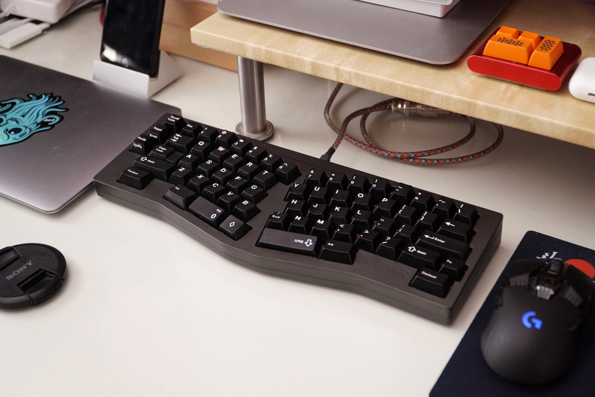
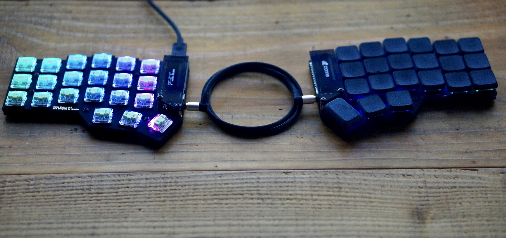
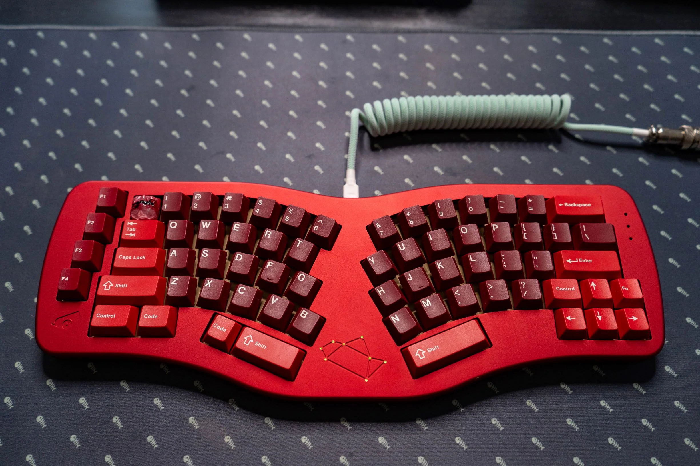
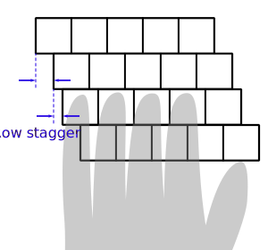
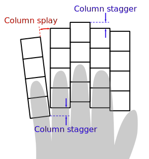

# Rigel96: a mid-ergonomic, split, columnar keyboard

In this discussion, I would like to:

1. Explain why I feel there is a gap in the market for a keyboard meeting a set of design requirements that haven't currently been explored fully by the community.
2. Show how those design requirements would influence the design of the keyboard.
3. Set out steps to build a prototype.

## §1. Why another keyboard?

As I understand it, there are two sub-communities within the keyboard hobby: the **ergonomicists** and the
**aesthetes**.

### §1.1. The two communities

The **ergonomicists** are those who:
- Reject the concept of the ridiculous, historical row-staggered layouts (of ¼, ½, and ¼ U). Why on _earth_ type on a
  keyboard that isn't even designed for the human hand?
- Are willing to reject (or ignore) build quality concerns if those impact on the keyboard's ergonomics (for example,
  preferring a 3D-printed split keyboard to an CNC aluminium traditional case).

 A typical collection of ergonomic keyboards from an ergonomicist (Credit: /u/teadetime, [via r/ErgoMechKeyboards](https://www.reddit.com/r/ErgoMechKeyboards/comments/145f952/my_growing_40_collection/))

The **aesthetes** are those who:
- Follow the latest switches, keycaps, and keyboard developments.
- Keyboards are rated based on their tactility, plate flex & feel, "thocc" (whatever that is to the speaker...), build
  quality, graphic design.
- Most of the community's energy goes towards building, lubricating, CNC milling aluminium, gaskets, and so on.

 A typical collection of expensive traditional keyboards from an aesthete (Credit: /u/deej_is_typing, [via r/MechanicalKeyboards](https://www.reddit.com/r/MechanicalKeyboards/comments/11wqrlc/made_a_bookshelf_for_my_keyboard_collection/))

These two ideals are clearly pursuing different goals, and _both_ have made significant progress in the last decade.

Ten years ago in 2010, the custom keyboard hobby was just expanding. There were few choices then for keyswitches, or
keycaps. GMK's first group-buy for keycaps only ran in 2013 (I believe).

The _aesthetes_ made huge advances, through testing and iterating on keyboards, launching group-buys to push the hobby
forwards where manufacturers were afraid to commit investment on new product lines.

Features initially pioneered on enthusiast boards are now entering common availability on low-cost pre-built keyboards:
a gasket-mounted flexible (PC) plate; hotswap sockets; high-quality, low-cost factory-lubricated switches (such as
Gateron Milky Yellow Pro); acoustic foam; aluminium cases... Unbelievable ten years ago, when the state of the art for a
pre-built was a creaky ABS case with soldered-on Cherry MX Browns.

The _ergonomicists_ also forged ahead, taking inspiration from classics like the Kinesis Advantage (2002) or Maltron
(1970s). With cheap 3D printers available everywhere, custom designs proliferated. Two leading families are the Corne
and Ergodox, with most ergonomic keyboards now claiming inspiration from these, or one of their descendents.

> These two keyboard communities are pursuing two separate axes of aesthetics and ergonomics. Why are there so few
> design cross-overs between these communities? Is it really not possible to learn from both?

### §1.2. The gap in the market

For me, this feels like a **gap of opportunity** in the market.

> Why not design a "nice", aesthetic design, that _retains_ the features most-loved by aesthetes (gasket-mount, flexibly typing feel, pleasant sound profile), while
> _incorporating_ the innovations explored by the ergonomicists?

Here, I show some existing designs mapped onto these axes of aesthetics and ergonomics. We can see that all the best-selling "enthusiast" boards (aluminium, gasket-mounted) are on a clear axis of price versus build quality (at least, as attempted by the designers). The ergonomic scene has a mixture of designs, some extremely low-budget, designed for home-soldering and with very basic and cheap sandwich cases; while also there's a secondary market of more premium models catering for enthusiasts who are fully bought into the ergonomic model.

In the centre, we see a large gap. Where are the keyboards offering an ergonomic step-up to the users, stuck on 65% boards and worrying about whether the gaskets are too soft, or the plate too firm?

### §1.3. Design priorities to meet this market gap

I will formalise this as an attempt to pursue the following **design priorities**. (All designs are conceived and
developed according to a set of prioritised goals, which determine which qualities should win over others: price, build,
features... All designs involve trade-offs, explicitly or implicitly, which are resolved according to the design's
goals.)

> 1. The design must keep the **standard finger-to-key assignments** of a traditional keyboard.
> 2. The design must appeal to aesthetics enthusiasts: we cannot compromise on features that are regarded as **bare-minimum requirements for a 75% keyboard**.
> 3. The design must **not make any terrible ergonomic trade-offs**.

Regarding **finger-to-key assignments**, we believe that there is a large market of people who have learned to touch-type, and are scared to try to re-learn typing. This is evidenced by the vast community buying enthusiast-level TKL keyboards, 75% keyboards, even 40% keyboards – and all using the legacy row-staggered layout. Some of the more popular of these enthusiast boards are Keychron Q-series ($150), Monsgeek M1 ($99), or any of the multitude of high-end designs such as the Mode Sonnet ($300). So clearly there's a huge number of users who are simply very, very attached to their existing layout. Those users who are willing to move to a 40% board, yet not try split or columnar layouts, are surely an extreme example of commitment to aesthetics over ergonomics.

So, I regard it as a design principle that we should explore the design space of keyboards with four (or three) keys per finger (1-Q-A-Z, 2-W-S-X), laid out roughly in a column, and with a fairly standard location for the Shift keys, modifiers, Space bar, and so on.

Regarding the **aesthetic requirements**, I have ranked these higher than the ergonomic concerns. This is because, all else being equal, if we pursue ergonomics first then we'll simply be producing a Corne clone, which is not novel, and so far hasn't conquered the custom keyboards world. We have to see how far we can go on ergonomics, _without_ compromising on the minimum bar for aesthetics that dominates the mechanical community.

The **ergonomic trade-offs** are middle-of-the-road. Refusing to do anything terrible does rule out a lot of possibilities (given that most keyboards are in fact pretty terrible for ergonomics), but it doesn't compel us to pursue a maximum-ergonomic route.

In conclusion, I feel that these reasonable requirements are hardly met by any current keyboards on the market, or in past Group Buys, which justifies blessing the world with yet another keyboard design!

## §2. Applying the three design principles

### §2.1. Firstly, applying the principles to existing keyboards

#### A. The full-sized, the TKL, the 75%

I don't know the precise date when the full-sized fell out of favour. Certainly in 2010, there were plenty being sold, but since then, the shift to TKL, then 75% or 65% has changed the most-popular layout.

Bizarrely, the world has realised that the TKL block, with its Insert keys, Print Screen, and Screen Lock, is taking up "valuable" space that should be reclaimed for the sake of a more ergonomic mouse position, but then totally fails to reform in any way the ergonomics of the actual Alphas!

No matter how pretty, or advanced in their manufacturing process, I would say that all of these fail to meet the requirement, **do not make any terrible ergonomic trade-offs**.

 The [Mode Sonnet](https://modedesigns.com/products/sonnet) (Credit: Mode Designs)

 The [Keychron Q1](https://www.keychron.com/products/keychron-q1) (Credit: Keychron)

#### B. The Alice

In 2018, Yuk Tsi released the TGR Alice, based on the earlier EM7 keyboard.

Before this 2018 Alice, I reckon there were very, very few boards made with a design like this, possibly just a few limited production runs of boards such as the EM7.

The TGR Alice (Credit: yuktsi, [via GeekHack](https://geekhack.org/index.php?topic=95009.0))

Of course, the TGR Alice itself was not produced in great numbers, but spawned a large number of budget knock-offs, such as Epomaker's Feker Alice 80, or Keychron's Alice boards.

Why is it growing in popularity? My guess would be, because it meets _some_ of our design requirements!

It _retains_ the standard finger-to-key assignments, including **standard placement** of Shift, Enter, and so on; allows for manufacture with to **no compromises on aesthetics** (CNC aluminium, standard plate-to-case mountings); and **makes a half-hearted attempt at ergonomics**, clearly placing this design goal in last place.

Unfortunately, the layout turns into some kind of weird half-way set of compromises. There is massive and jarring splay for the little finger ("pinky" in American English), of 10° or up to 15° on some models, with some very unfortunate compromises on key positioning due to trying to implement this splay while using a row-staggered layout.

It's a nice try, but I think we should do better.

#### C. The ErgoDox

The ErgoDox, by Dominic Beauchamp (Dox) in 2012, was an early split columnar keyboard. Before this, there were not that many ergonomic board, with many models seeming to come from a few established companies (Maltron in the 1970s, then later Kinesis in the 1990s as well). The ErgoDox was the start of a new wave of open-source, community-led designs for ergonomic keyboards, preceded only by a limited production run of the Key64.

The ErgoDox set the standard for future ergonomic designs: split, and columnar.

According to my design principles, this deviates in a few ways. By moving the modifier keys to the thumbs, although arguably better, it doesn't maintain standard finger-to-key placements. And, it fails to incorporate many of the build-quality enhancements subsequently developed by the mechanical keyboards community.

These are not _criticisms_ of the design, but simply a remark that it is pursuing different design goals to the ones set out above.

Nonetheless, the ErgoDox's influence was very significant. Subsequent open-source designs are all heavily influenced by it (such as the [**Redox**](https://jeremy.hu/redox-a-new-keyboard/) by Jeremy Herve), and it has been widely commercialised as the [**ErgoDox EZ**](https://ergodox-ez.com/) and [**Moonlander**](https://www.zsa.io/moonlander/), and by other companies too (such as the keeb.io's Iris).

 The Key64, the original community split columnar keyboard (Credit: Nestor A. Diaz, [via r/MechKeyboards](https://www.reddit.com/r/ErgoMechKeyboards/comments/exbtfz/key64_the_original_custom_libre_ergonomic_split/) and [www.key64.org on Archive.org](https://web.archive.org/web/20150610120432/http://www.key64.org/))

 The Ergodox (Credit: [Drop.com](https://drop.com/buy/ergodox), [via ergodox.io](https://www.ergodox.io/))

#### D. The Corne

The Corne, by Kosuke Adachi (foostan) in 2018, is very similar to the ErgoDox at a high level, but makes changes to the key placement and construction.

The same conclusions apply as for the ErgoDox.

Popular Corne derivatives are the [Lily58](https://github.com/kata0510/Lily58) (Naoki Katahira, 2018), with a little less stagger than the Corne; then the [Sofle](https://josefadamcik.github.io/SofleKeyboard/) (Josef Adamčík, 2019).

 The Corne (Credit: foostan, [via GitHub](https://github.com/foostan/crkbd))

#### E. The Dactyl

The Dactyl, by Matthew Adereth in 2015, is a very interesting evolution of the ErgoDox. As far as I can tell, it was one of the first community-driven keyboards to really explore the idea of a concave keyboard, and in particular, uses recessed key wells for each finger individually (like the Kinesis Advantage, with the middle finger's keys deeper than the little finger's keys, unlike the earlier Maltron). This coincided with the rise of 3D printers, which is probably why it hadn't been made before.

This was influential, with subsequent developments such as the Dactyl-Manuform, the [Skeletyl](https://github.com/Bastardkb/Skeletyl) (Quentin Lebastard), and more.

 The Dactyl (Credit: Matthew Adereth, [via GitHub](https://github.com/adereth/dactyl-keyboard))

#### F. The Sagittarius

In 2020, Álvaro Volpato (Gondolindrim) released the Sagittarius, which is an **awesome** design.

They built a truly awe-inspiring attempt at a fully ergonomic Alice layout. Now, Gondolindrim made some different design choices to what I would have made, perhaps, but the dedication to this project was immense.

It combines a sophisticated anatomical model of the human hand, combined with empirical measurements, which are used to provide input to an optimisation solver that minimises hand strain for the given mechanical-anatomical model.

This could really claim to be most ergonomic (or perhaps only ergonomic!) Alice layout.

The most exciting thing about this project, to me, is that **almost entirely meets my own design requirements above**.

* It's an Alice-style layout, so it has completely ordinary key positions. Yes, it does have row stagger rather than column stagger, but it's very deliberately laid out such that it does _not_ allow itself to be hampered by the legacy stagger spacing (¼U, ½U, ¼U).
* The build quality is phenomenal. It truly is a keyboard aimed at the r/MechanicalKeyboards aesthetes community, not r/ErgoMechKeyboards ergonomicists.
* The ergonomics are best-in class, with few-to-no compromises.

The key inspiration of Sagittarius is showing that there really _is_ a market for a much better Alice-style board, without compromise on ergonomics or build quality. The only disappointment is that it _seems_ like the ergonomic design was mainly developed from the ground up, based on the Alice layout as its starting template, rather than collaboratively building on the insights of the ErgoMechKeyboards community and the direction they have standardised on over the last decade.

 The Sagittarius (Credit: Gondolindrim, [via GeekHack](https://geekhack.org/index.php?topic=109701.0))

#### G. The Cornelius

In 2021, Kosuke Adachi (foostan) released a new manufacturing design for the existing Corne keyboard.

Cornelius is a super-high-quality version of Corne, on a gasket-mounted plate inside a CNC-milled aluminium case.

Even more so than the Sagittarius, it's an example of a very rare cross-over between the two keyboarding communities. It's a true classic of the ergonomicist scene (in fact, one of the most-copied and influential ergonomic keyboards), but released with the typing-feel of a high-end keyboard build.

 The Cornelius (Credit: foostan, [via GeekHack](https://geekhack.org/index.php?topic=109741))

### §2.2. Secondly, producing a design that meets the three design principles

The tasks which most-shape the keyboard are the choice of key layout, and the physical/spatial positioning of those keys.

We start with the basic presupposition that:

- Our requirements force us towards having a standard QWERTY layout (or in my case, Dvorak layout, but it makes no difference, it's just a different labelling of the Alphas).
- We are basically committed to having a columnar layout, because according to my interpretation of the design requirement "do not make any terrible ergonomic decisions", any design with row stagger is "terrible".
  - Ortholinear (that is, no row stagger nor column stagger) is _acceptable_ but would be very surprising. If you're attempting to target ergonomics to any degree, it would be an astonishing process that landed on this layout, which, at a first glance, does not apperently resemble the dimensions of the human hand at all.
  - We can basically rule out ortholinear immediately, and expect to design something with column stagger.
  - Similarly, an un-split layout would be surprising. Whether or not it's a uni-body, or instead has split halves, we should expect our "mid-ergonomic" goals (not terrible, but not all-in) will lead us to some kind of split between the hands.

> I'm going to call this the "Elspeth" layout. The "Alice" layout uses a ladies' name to describe the popular split-but-row-staggered layout.
>
> Let's give the name "Elspeth" to a "columnar Alice" layout.

#### §2.2.1. Our keyboard layout

So, our task is to design an "Elspeth" layout, according to the design goals.

At this point, we're committed to maintaining the standard key assignments, so we don't have many choices in the overall grid that the keys are being laid out on.

One issue is **monoblock or split**. I think we can resolve this quite quickly and easily: a split keyboard is more flexible, in that you can adjust the angle of the two hands according to your preference. A monoblock Alice/Elspeth layout does work, given that a 20–30° angle between the sides is adequate for most people, but nonetheless, choosing a monoblock is artificially restrictive. So, I am planning a **split layout** to begin with.

Just for completeness, I'll throw in a separate numpad too, so it's a three-way split layout. I quite like my "southpaw" (positioned on the left) dedicated numpad!

So, it's an **1800 layout**, with a **three-way split**. I personally prefer the 1800 layout (stepped arrow keys) compared to a 96% layout, but there's really no principled reason I can think of to decide between them, it's just a preference, so I'm going with my preference on a snap decision.

As for why I chose an F-row (96% or 75% over 65%) that's just because of  the desire to maintain the standard key layout as much as possible. And, the decision to go with a 96% rather than 100% (or 75% rather than 80%, i.e. the choice of layout for the Home/End block), that's determined by: a) fashion, the growing consensus that the Home/End block is too wide and that the Insert key is superfluous; and b) the fact that it's just too wide on a split keyboard.

So, with that all decided, here is the layout:

 [Keyboard Layout Editor layout](http://www.keyboard-layout-editor.com/#/gists/44e1f45338d9528cabf2b6c0f85144a3)

#### §2.2.2. Our layout's physical positioning

Next, we need to determine the actual physical/spatial positioning of those keys. Although they are broadly laid out as shown in the grid, each key's position can be budged by a few millimetres for improved ergonomics.

These are the parameters that describe a keyboard's spatial layout:

 On a row-staggered keyboard (which we've rejected as a design) the **stagger** is the left-right distance between two rows. It is a per-row parameter. Row stagger is overwhelmingly common in the world of standard keyboards.

 On a columnar keyboard, the **stagger** is the forwards-backwards distance between columns (a per-column parameter). The **splay** is the angle between adjacent columns. A keyboard with no stagger or splay is called **ortholinear**. Splay is a fairly rare feature, with most keyboards, even ergonomic ones, opting for no splay, but a few designs (such as [KLOR](https://github.com/GEIGEIGEIST/KLOR)) even feature quite a large splay for the little or ring fingers.

 A keyboard can also have a column **recess**, which is the up-down distance between columns. Recess is fairly rare, even in the ergonomic community, with most ergonomic columnar boards (such as Corne) laying out the keys on a flat plane.

 Finally, concavity is a per-row parameter describing the curve of the keyboard's plate along each column. A concave keyboard can be cylindrical, or ever spherical in its concavity. When a design goes as far as adding concavity, it is always accompanied by column stagger and recessed columns as well, so that each finger is moving along its most natural curve.

It turns out that some of these parameters are mutually exclusive according to the construction technique chosen.

* **If you have a flat plate**, then clearly you can have stagger, and even splay (rare), but recess and concavity are impossible.
* **If you have a 3D-printed plate** (or injection-moulded), then any shape is possible... but the typing feel will be altered, and some would say, compromised. When the plate is shaped plastic, you won't get the same feel and sound as a metal or polycarbonate plate that's gasket-mounted. The examples here are either moulded commercial projects (such as Kinesis Advantage), or small-volume enthusiast keyboards (such as the Dactyl, and its descendents the "dactyls"). The knock-ons for PCB design (or hand-wiring) are significant as well.
* **If you have a shaped metal plate**, then you'll be stuck with either hand-wiring, or a flexible non-FR4 PCB. This implies that the plate isn't getting any support from the PCB, so those super-flexy polycarbonate plates aren't going to work. This is the opposite of a "half-plate" keyboard, which exists on the axis of Brass ↔ Aluminium ↔ Polycarbonate ↔ Nothing, where the plate is non-existent and it's just the FR4 PCB providing support. But when the plate is curved, forcing a PCB-less design, then you forcibly need a stiffer plate. Remember that on a traditional keyboard with aluminium plate and FR4 PCB, the switches hold the two together in a sandwich, like a truss bridge. When the PCB is gone, you need something stiffer than a polycarbonate plate.
 
* Finally, **if you have a solid metal plate**... then you probably blew your budget! I can't imagine anyone would end up CNC-milling a block of metal to make a complicated plate geometry.

Sub-dividing, within the design space of shaped metal plates, we have **rolled plates** (sheet of metal, bent into a smooth curve on a roller), **brake-bent plates** (square sheet of metal, folded along fold lines), **split plates** (just cut the plate into strips or pieces, and gasket-mount each separately, avoiding the need for a bend), and **compound bent plates** (where the bend lines don't go all the way across the sheet, such as die-bent).
 

Again, there are trade-offs here too. Just as a single planar sheet doesn't allow for concavity or recess, then if you use a brake-bent sheet for concavity, you won't be able to achieve any column stagger!

So the trade-off is between build complexity (and cost), against ergonomic benefits. This is even assuming that using a sprung sheet even offers any improvement over a 3D-printed hull (a dactyl)!

After experimenting with my own fingers, I feel that it's really quite hard to give up column stagger. I wouldn't say that there's _no_ benefit to a columnar layout without stagger (compared to a row-staggered layout), but I do feel that if you move to a columnar layout, you should expect to incorporate at least a little stagger, to capitalise on the gains. There's just such a great disparity between the length of the middle finger and little finger, that something needs to be done to accommodate it.

So we narrow it down to these construction options:

* A flat sheet, with column stagger. This is basically a Corne, but with a conventional R4 layout (spacebar row). Corne + Alice-spacebar-row can be built on a flat sheet. Any amount of splay is possible too.
* Introducing a recessed middle-finger-column would require using a split plate (separate plate of its own for the recessed column), or else doing some bending of the sheet. To me, this seems to offer little usefulness. I haven't done a proper ergonomic test of the benefits of the recessed column, but I believe the gains to be marginal.
* Finally, a compound-bent sheet allows for concavity. Here, the benefits seem more profound, and you actually capitalise on the cost of the bent sheet with some real gains.

It may be a very foolish move, but I really am tempted to target my design right at the limits of what's possible.

> So! I announce: Rigel96, a columnar, concave split keyboard!

 More detailed plate design, showing positioning of keys with stagger.

| Design parameter | Value |
| ---------------- | ----- |
| Column splay | Based one some measurements of my hand, I'm going to prototype with 4° splay between little finger and ring finger, and 1° splay ring to middle. This isn't critical, but it just brings the 'Q' key a little closer in reach, and avoids about 1-2mm of stretch to the Tab key. It's hard to be sure (without any ergonomics training myself) exactly what the natural bending of the little finger is, but I'm willing to experiment with a little bit of splay to see. |
| Column stagger | A lot of design seems to go into this, between all the different Corne-alikes! This [incredible tool (compare.splitkb.com)](https://compare.splitkb.com/) by [John Helveston](https://github.com/jhelvy/splitKbCompare) allows comparing. Corne is pretty gentle, Lily58 even more gentle, while Sofle V2 increases the stagger (which Josef Adamčík explains [in this blog post](https://josef-adamcik.cz/electronics/soflekeyboard-evolving.html)), and Atreus has the most extreme stagger.  I measured my fingers and attempted to gauge their natural finger positions, and found that the Corne really does seem to offer a good balance.  I'm using these as my initial staggers for prototyping:  G-col to F-col: +1.5mm  F-col to D-col: +2.5mm  D-col to S-col: -2.5mm  S-col to A-col: -4.5mm |
| Column recess | Why is this so rare? Well, because most hobbyist split columnar boards use flat plate. It actually _is_ common on dactyls. I found that there's no benefit to recessing the G-column (first finger needs to be able to move easily from 'G' to 'F'); that there is some benefit to recessing the D-column; that 'F' and 'S' sit very naturally on a plane; and that recessing the A-column and Tab column upwards is a right pain for the process of bending.  I'm therefore using a 3mm D-column recess. |
| Column concavity | As discussed below, I chose:  Row-4 to row-3 plate angle of 13°  Row-3 to row 2 plate angle of 0°  Row-2 to row 1 plate angle of 16° |

The final complicating factor in the the design is the **keycaps** themselves and their **keycap profile**. For the concavity, a finger length of 75mm (my index finger) implies that a 19mm keycap subtends an angle of 15°, which is based on placing that 19mm keycap on the circumference of a circle of radius 75mm.

However, the hitting surface of the keycap may be _already angled_, plus, popular keycap profiles like MT3 or SA are perilously close to colliding (or actually colliding) if angled at 15°.

> What keycap profile is appropriate for a concave plate?
>
> How much concavity can we have, and how much do we need?

If we target the 15° concavity that's used by most Dactyl and Dactly-Manuform derivatives (and which matches my 75mm index finger), then we realise that this won't work for all keycaps profiles.

* For Cherry, it's simply very sub-optimal. I've seen some incredible work [on the Tryadactyl](https://github.com/wolfwood/tryadactyl) which uses some super-complex geometry for the plate to make Cherry work. But it's a totally over-fitted design in the sense that it will then _only_ work for Cherry, and the tolerances are very tight, and I simply don't think it would be possible to do by sheet metal bending.
* For SA and MT3, it's too tall, really. I measured the row-to-row concavity on the [Bastardkb Charybdis](https://github.com/Bastardkb/Charybdis/blob/main/files/3x5%20nano/charybdisnano_v2_v187.stl) and found it was pretty much exactly 15° again, and Quentin claims that MT3 will work, but it must be pretty tight (or has he fractionally increased the key-to-key spacing from 19.05mm?). I have an MT3 set, and I feel the collision risk is getting quite high.
* But [MTNU](https://matt3o.com/mtnu-pre-order-phase-starts-now/) by Matteo Spinelli (Matt3o) works really well! The hitting surface is pretty much as large as you can get without getting interference. The R2-to-R3 angle is already 15° at the keycap top surface, so to achieve the correct angle for the next rows you don't need so much.

> I will design Rigel96 specifically to be optimised for the MTNU profile (even though I don't even have a set yet).

This gives:
 R4-to-R3 plate angle of 13°
 R3-to-R2 plate angle of 0° (but the keycap tops still have their concave angle)
 R2-to-R1 plate angle of 16°

 Technical drawing of the plate cross-section.

<iframe width="100%" height="500" style="border:1px solid #eeeeee;" src="https://3dviewer.net/embed.html#model=https://raw.githubusercontent.com/NWilson/keyboards/main/02-keyopatra-project/CAD%20resources/Rigel%20plate.step$camera=-106.14261,-187.26347,149.48200,8.92477,42.87129,-3.94118,0.00000,-0.00000,1.00000,45.00000$cameramode=perspective$envsettings=fishermans_bastion,off$backgroundcolor=255,255,255,255$defaultcolor=200,200,200$edgesettings=on,0,0,0,1"></iframe>
 3D CAD file for the plate of the left-hand-side of the split keyboard.

## §3. Steps towards a prototype

Broadly, I aim to:

1. Produce myself a set of CAD files for the keyboard plate. Status: ~done, first draft.
2. Post on GeekHack / other forums to get design feedback.
3. Finalise concrete manufacturing plans for a limited run of concept-prototypes (~10 units, perhaps). These would consist of a bare keyboard plate, screwed to a block of wood at the front and another at the back. Offer these prototypes on a forum for review & feedback.
4. Make design changes, propose a case design and manufacturing plan for a full unit (top+bottom case, plate, and PCB or hand-wiring plan).
5. Run an Interest Check to poll for final feedback.
6. Run a Group Buy to produce perhaps ~50 units (or more, but I'd be astonished if even 50 bought my keyboard).

The first steps, doing some CAD and soliciting feedback, are simple, and I can certainly do them myself.

From then on, it all depends on the level of interest received.

* If it falls flat, then I guess I'll make a single unit with hand tools at home. I certainly wouldn't ever be able to get a CNC case (or even 3D resin-printed case).
* If it picks up interest, and ten people would be willing to participate in a round of prototyping, that would be exciting.

### §3.1. So far, I have:

* Produced some CAD files for the proposed plate design. It's a single metal plate, which I'm intending to have laser-cut in 1.5mm steel.
* The plate has separate fingers, so that it can be individually bent.
* I have CAD designs for a set of 18 (!!) small blocks of hard steel, which can be used to very precisely bend the steel plate in a small hydraulic press. Using registration cutouts, which lock the die to the plate by slotting into the keyswitch cutouts, the bending can be done by hand by simply placing the work item into the interlocking die, and pressing. It would take 15 presses to do a single sheet, so we'd be looking at (hopefully) less than an hour of manual labour per item, once all the one-time setup and prototyping has been done.

So, this is a solid plan here for a very small manufacturing run of prototypes. The laser-cut and press-bent plates can be screw-mounted onto some simple blocks of wood, to be used to hand-wire a very basic working prototype. Then I would be able to daily-drive it and assess the design.

(The final design would be gasket-mounted to a wood, resin, or aluminium case, not screw-mounted!)

### §3.2. My next steps:

* Post this design to appropriate forums, to gain feedback
* Manufacture a cardboard prototype at home, in preparation for moving to a steel prototype

### §3.3. Design resources

[Full set of resources on GitHub](https://github.com/NWilson/keyboards/tree/main/02-keyopatra-project/CAD%20resources)

### §3.4. Attic / work-in-progress

Case design

- major choice is between resin (SLA print), wood (CNC), or aluminium (CNC).
- assuming a two-piece case with screws to hold together, and slot in between to hold gasket-mounted plate.
- The interior surface of the case is uncontroversial, it's just a rectangular hollow interior underneath the keyboard the plate. Interior space to hold a microcontroller and a sheet of poron
- The exterior surface of the case is "just" a matter of doing a bit of lofting/shaping of the profile to make it just a _little_ bit nicer than a cuboid box

Tenting system

- want to support docked units with little-to-no tenting
  - with/without splay
  - with forwards/backwards tilt
  - want front and rear attachment points
  - short and long single legs
    - simple: it's a leg, it just rotates and locks
  - short and long T legs
    - yikes, three-way axis support needed!
    - OK, so need a two-axis fastening to the board
    - and the connecting rod will allow a short or long single leg to be attached. simples!
- want to support undocked units with larger amount of tenting
  - base-plate system?
  - or leg-based system?
  - use a single universal locking nut in the centre, for compatibility with tripod/chair mounting
